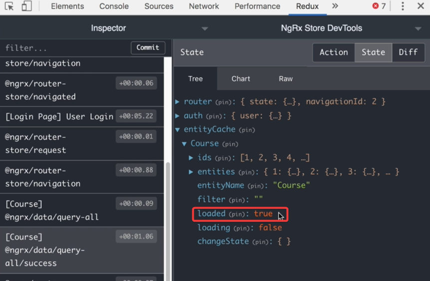
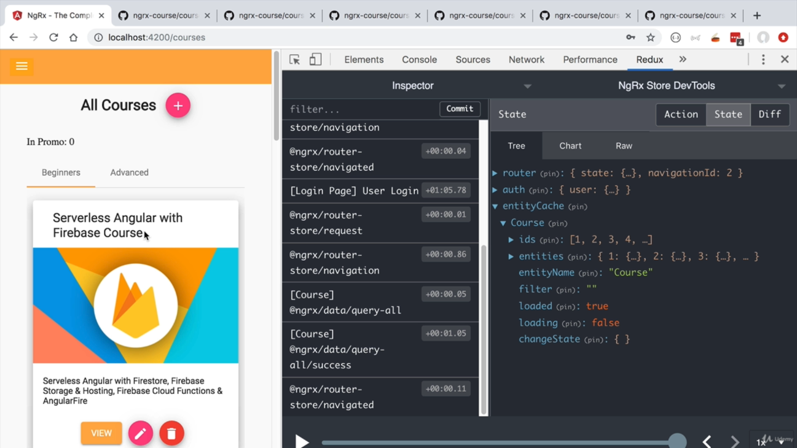

## Section 6: NgRx Data In Depth

### 38. Setting up NgRx Data in a Lazy Loaded Module

app.module.ts

The root application module will not itself have any entity associate to it. They are only associate to submodules like the lazy loaded courses feature module. Hence, we pass only an empty configuration object. to the forRoot method.

courses.module.ts

configuration for the course entity. We will leave the configuration empty for now

We will also be adding a service to this module

Because this is a lazy loaded module we have to inject an entity definition service. We will use it to register the entity metadata map.

course-entity.service.ts

The CourseEntityService is actually a facade service which will allow us to do many things such as fetch data from a backend, save and access entity data in the store, and so on.

It brings together all the functionality we need to manage our course entity data.

### 39. How Does NgRx Data Work? Transparent Fetching Data in Action

courses.resolver.ts

We inject the `coursesService` and use its `getAll()` method. ngrx data will automatically generate a get request to your backend using common conventions. We will be customizing this method to suit our application.

Note that observable returned is for a list of courses so we have to use the pipe operator and map it to a boolean.

courses.module.ts

As before we add the resolver to the routes.

### 40. NgRx Custom Data Service - Fetching Data From the Backend

courses-data.service.ts

All we need to do to override the default behaviour of `getAll()` is to implement a custom data service.

We customize the getAll() method to send back the content of the payload key from the response to a get request to /api/courses.

courses.module.ts

Make sure to add the new service to providers and register the service.

Notice the auto generated actions dispatched by ngrx data will take care of requesting data from the backend and updating the store with the courses.

### 41. Controlling Data Loading with the NgRx Data loaded flag

Note that ngrx data has provided a loaded flag for us

courses.resolver.ts'

We are going to tap into the loaded observable and ensure that we only make a request to the backend once, if the courses have not been already loaded.

The `filter` and `first` ensure that the transition to the target page do not happen until the resolver has fully loaded the courses.

### 42. Querying Store Data with NgRx Data and the entities$ Observable

home.component.ts

Refactoring the home component to stop fetching data from the backend and instead get it from the store using our coursesService.

We don't need the loading flag anymore since that is being handled by ngrx.

courses.module.ts

fixing the sort order of the courses

### 43. NgRx Data CRUD - Optimistic Updates

edit-course-dialog.component.ts

Replace the http service with our new coursesService. Ngrx data will take care of the actions and effects needed to send a request to the backend and update the store.

courses.module.ts

**By default ngrx will not update the store until the request comes back successful.** We want the changes to be reflected immediately ie optimistically. We do this with a configuration change

Notice that we did not have to write any new actions as ngrx data has taken care of this for us. There is an action to send a put request and an action to update the store with the new course data.

### 44. NgRx Data CRUD - Pessimistic Data Creation

We want a post request to add a new course and save the response to the store

edit-course-dialog.component.ts

Our coursesService has an add method for this purpose which returns an observable for the response to the post request. We subscribe to the observable so we can log the new course and close the dialog when the new course is emitted

Note that the default behaviour is pessimistic ie the dialog will not close until the post request has completed. This behaviour is fine so we will not edit the configuration

NgRx Takes care of dispatching the necessary actions and making the post request using common conventions.

