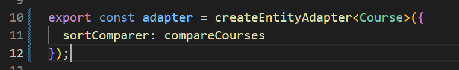

## Section 5: NgRx Entity in Depth

### 26. Feature Design - Defining Actions First

We will begin by defining the actions

loadAllCourses is more of a command that will tell the application to fetch data from the backend

- it will come from a resolver

allCoursesLoaded is more of an event in response to successful fetching of the courses from the backend.

- this is needed to tell the application to put the fetched data into the store

Similar to what we did with the auth actions we add a new file under courses/ called action-types.ts so that we can export all the actions under the convenient name `CourseActions`

### 27. Loading NgRx Entity Data using a Router Resolver

Note the @Injectable annotation to denote that this resolver is an angular service.

To ensure completion of the action, eg. the `first()` operator will make it so that the observable must emit at least one value before letting the router know that the root transition can be completed (router can show the target screen).

`loading = false` we use a flag variable to ensure that the action is dispatched only when it is not already

`finalize()` we must set the loading flag back to false once the action has completed.

courses.module.ts

We have to add a resolver to the routes for the courses module so that the router will resolve any necessary data for the page before loading the target page.

We also have to add the resolver into the module's providers since it is an injectable service 

### 28. NgRx Effects

When the loadAllCourses action is dispatched we want to create a side effect of fetching courses from the backend

We then dispatch the `allCoursesLoaded` action to store the fetched data in our store.

courses.module.ts

Make sure to import the effects module

### 29. Understanding the NgRx Entity Format

Easiest way to store the new courses state inside the store would be to directly store the array of courses under a course key. However this is not practical for common operations such as looking up courses by id.

A better way is implement a map. This entities property is a map whose keys are the course ids and the values are the courses corresponding to the course ids. There is still a problem with this in that the ordering of the courses might be important and we would need an auxiliary function to transform this map to an array.

One way of preserving the order would be to an ids array and an auxiliary function would be able to combine the information with the entities map.

This format below is called the Entity format. It consists of a map of the entities and an array that defines the order of the entities.

Note that our Courses have a sequence number which is information on the order they should be displayed.

The NgRx Entity module allows us to very easily store our entity data in the Entity format above. 

Have the CourseState extend the EntityState interface

Notice that we have the entities and the ids properties now

### 30. Implementing Reducers Using the NgRx Entity Adapter

Having the courses state in the entity format makes it convenient to query but now it is cumbersome to do common array options on it in this format such as adding courses.

This is why we create an entity adapter. Note that this adapter has many convenience methods shown below.

We will use the `getInitialState()` method of the adapter to set the initial courses state and then createReducer to create our reducer.

on dispatch of the `allCoursesLoaded` action we want to store all the courses in the store.

Add the reducer to courses.module.ts

In the redux devtools on login we can see the courses are successfully being stored in the entity format.

### 31. NgRx Entity Selectors

The NgRx entity adapter has premade methods for generating selectors. We want to select all courses.

course.reducer.ts

From this selector we make a few more selectors which are needed to populate the home component.

home.component.ts

Refactoring the home component to select data from the store instead of making requests to the backend.

### 32. Entity Adapter Configuration - Understanding sortComparer and selectId

course.ts

we add property sortComparer to our adapter to tell it to use the function `compareCourses` from our Course model as the sorting order for the entities.

The `selectId` property takes a function that returns the intended id field for the entity. We don't need this property because our courses have a field name `id` which ngrx will recognize by default.

course.reducers.ts

final

### 33. NgRx Data Fetching Solution - Load Data Only if Needed

A problem we need to address with our current implementation is that the courses resolver is going to dispatch the load all courses action again every time we navigate the courses page, including when we navigate somewhere and click the back button. This will create redundant api calls.

We will add a boolean `allCoursesLoaded` flag and add it to the reducer and initial state

courses.reducers.ts

create a selector so we can use it in the resolver

courses.selectors.ts

and add another condition to the resolver logic

We also filter the output to only courses loaded

courses.resolver.ts

### 34. Optimistically Editing Entity Data - The Edit Course Dialog

We want to edit the course data using a form.

courses.actions.ts

As usual we start by defining the actions for this functionality. We will only be needing one action `courseUpdated` which when dispatched will modify the data in the store in place and send a background effect to update the data in the backend. 

edit-course-dialog.component.ts

We should not be calling the backend from the dialog form but modifying the store so replace this accordingly in the constructor.

In the `onSave()` method which is executed on button click we will build an update object and dispatch the action. The course object here will contain the new course details from the form. 

