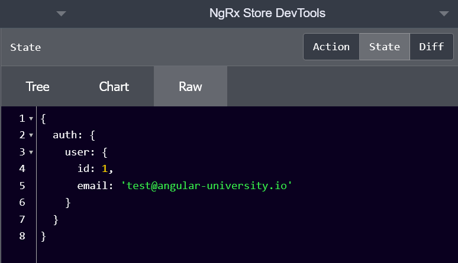
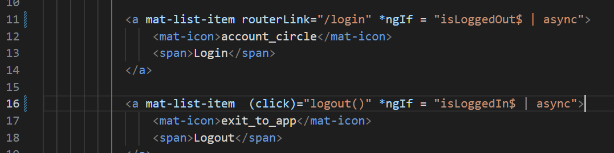
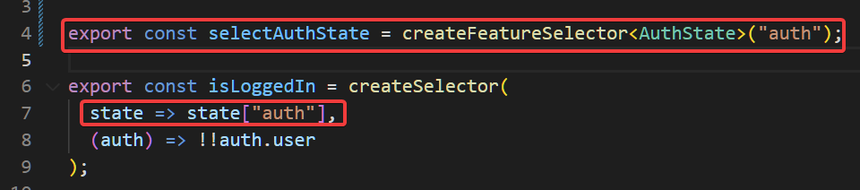

# [NgRx (with NgRx Data) - The Complete Guide (Angular 15)](https://www.udemy.com/course/ngrx-course/)

setup

`npm install`

`npm run server` - start the server

`npm start` - equivalent to npm run start

To add ngrx store

`ng add @ngrx/store --no-minimal`

Note: without --no-minimal angular will not create the reducers folder in app/

for ease of inspecting the store:

`ng add @ngrx/store-devtools`

###7.  Configuring an NgRx Feature Module using NgRx schematics

`ng generate store auth/Auth --module auth.module.ts`

where auth/Auth is in the form path-from-root-folder/name

path-from-root-folder where the root folder in our case is src/app/ and there is an auth/ folder in it
and the name is related to naming of the feature

### 8. The Store Service API - Implementing the Login Screen

Rename the `State` interface in app/reducers/index.ts to `AppState` to make clear that it is the global state for this application

Provide the store to the login component


### 9. Defining NgRx Actions Using Action Creators

Naming convention for actions

[dispatch source] Event name

dispatch source - where the action is coming from

Event - event or command that the action corresponds to


The `props` portion of this defines the type of payload that should be sent with the action


### 10. Grouping Actions Together with Action Types

We create a file action-types.ts in the auth folder and export everything in auth.actions.ts like so

```typescript
import * as AuthActions from './auth.actions';

export {AuthActions};
```

This is a very useful trick for grouping related actions together and making them accessible across the app.

### 11. NgRx Reducers

initialAuthState will be what is in the auth state by default

We also add how to modify the sate when the login action has been dispatched.




### 12. Key concepts summary - tracing ngrx actions and reducers

Rewriting the login() function in login.component.ts for debugging purposes


And auth/reducers/index.ts


Note the use of the `debugger` statement to pause execution at those points

- we click on login
- the component login() function is called
- a login action is dispatched
- the corresponding reducer is called
- the store is modified

## Section 3: NgRx Key Concepts - Selectors and Effects

### 13. How to Query the Store Data

We are going to show/hide the login/logout buttons depending on the auth state

**Use the convention of adding a $ sign at the end of a variable name for observable variables.**

Inject the store to the component by adding it to the constructor




This implementation will always work but is inefficient as eg. the same value of true will be emitted to isLoggedIn$ several times through the application run, every time the store changes. We only want to update the values when the auth state changes. To do this, we will use NgRx selectors.

### 14. NgRx Selectors

auth.selectors.ts


The first argument of createSelector is the slice of state we want

The second argument is a projector function which computes the value of isLoggedIn that we want. In our case we want it to be true if auth.user exists false otherwise.

Using this selector, the computation will only run again if the auth state changes. The results of each calculation will be kept in memory.

---

createSelector can also take a selector is the first argument, in which case the projection function will have access to the output of the selector. We use this to compute the isLoggedOut value.


app.component.ts


### 15. NgRx Feature Selectors

Previously we select the auth state using `state["auth"]` but this selection is not type safe and there is no intellisense when we do this

With a feature selector we will be doing the same thing but in a type safe way




### 16. Implementing User Logout

app.component.ts

When logout button is clicked a logout action should be dispatched


index.ts > authReducer

Adding another reducer to define how to modify the auth state


### 17. Implementing a Router Authentication Guard

We will create an authentication guard which will redirect the user to the login page if they are not logged in.

Note the @Injectable() decorator on the guard which is very easy to miss. If this is not added you will get an NG0204 error. The decorator is needed on every angular service.


Add it to the authmodule


app.module.ts

Specify that the courses route is protected by the AuthGuard


### 18. Introduction to NgRx Effects

auth.module.ts


app.module.ts

****

### 19. Understanding NgRx Effects

- we subscribe to the actions observable
- whenever the user login action is dispatched
- as a side effect we will put the user data into local storage

---

- don't forget to add the @Injectable() as this is another angular service


